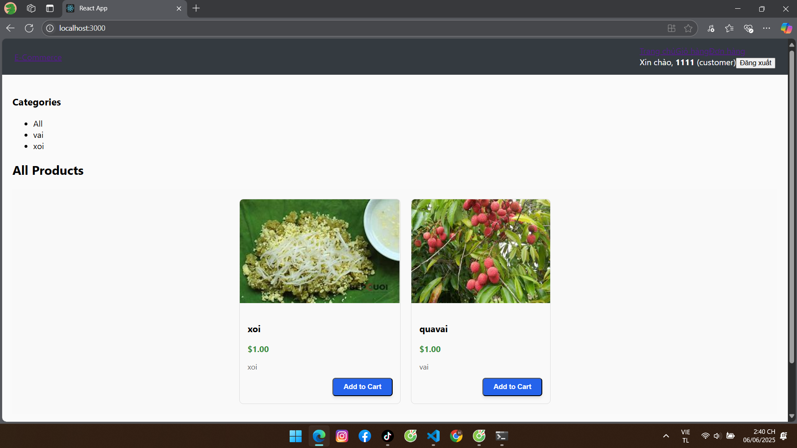

# 🛒 E-commerce website

Shopee Clone là một dự án thương mại điện tử mô phỏng nền tảng Shopee, được xây dựng với Django cho backend và React cho frontend. Dự án hỗ trợ xác thực người dùng, quản lý sản phẩm, giỏ hàng, đơn hàng, đánh giá và chức năng dành cho quản trị viên.

---

## 🚀 Tính Năng Chính

### Người dùng
- ✅ Đăng ký, đăng nhập, đăng xuất
- 👤 Lấy thông tin người dùng hiện tại

### Sản phẩm
- 📦 Tạo, cập nhật, xóa sản phẩm
- 🖼️ Tải lên hình ảnh sản phẩm
- 📂 Phân loại theo danh mục

### Giỏ hàng
- ➕ Thêm sản phẩm vào giỏ
- 🔄 Cập nhật số lượng
- ❌ Xóa sản phẩm hoặc xóa toàn bộ giỏ hàng

### Đơn hàng
- 🧾 Tạo đơn hàng từ giỏ
- 🔄 Cập nhật trạng thái đơn hàng
- 📜 Xem lịch sử đơn hàng

### Đánh giá
- 🌟 Gửi đánh giá sản phẩm (1–5 sao)
- ✏️ Cập nhật hoặc xóa đánh giá

### Quản trị viên
- 👥 Quản lý người dùng
- 📊 Thống kê hệ thống
- 📦 Quản lý đơn hàng toàn hệ thống

---

## 🏗️ Cài Đặt

### 1. Sao chép repository

```bash
git clone https://github.com/your-username/shopee-clone.git
```

### 2. Cài đặt Backend

```bash
cd backend
pip install -r requirements.txt
python manage.py migrate
python manage.py runserver
```

### 3. Cài đặt Frontend

```bash
cd ../shopee_clone_frontend
npm install
npm start
```

---

## 🗂️ Cấu Trúc Backend (Django)

- **Models**: `User`, `Category`, `Product`, `Cart`, `Order`, `OrderItem`, `Review`
- **Views**: `LoginView`, `RegisterView`, `LogoutView`, `CurrentUserView`, `AdminStatsView`, `CategoryViewSet`, `ProductViewSet`, `CartViewSet`, `OrderViewSet`, `ReviewViewSet`, `UploadImageView`, `ProductImageUploadView`, `UserViewSet`, `ClearCartView`
- **Serializers**: `UserSerializer`, `CategorySerializer`, `ProductSerializer`, `CartSerializer`, `OrderSerializer`, `ReviewSerializer`

API endpoint: `http://localhost:8000/api/`

---

## 🧩 Cấu Trúc Frontend (React)

### Components

- **Common**: `Button`, `Card`, `Navbar`
- **Auth**: `LoginForm`, `RegisterForm`
- **Products**: `ProductCard`, `ProductList`
- **Cart**: `CartItem`, `CartSummary`

### Pages

- **Auth**: `Login`, `Register`
- **Products**: `Home`, `ProductDetail`
- **Cart**: `Cart`, `Checkout`
- **Orders**: `OrderHistory`
- **Seller**: `SellerDashboard`, `ProductManagement`
- **Admin**: `AdminDashboard`

Frontend sử dụng **Axios** để tương tác với API.

---

## 📡 Một Số Endpoint Chính

### 🔐 Auth
- `POST /auth/login/`: Đăng nhập
- `POST /auth/register/`: Đăng ký
- `POST /auth/logout/`: Đăng xuất
- `GET /auth/user/`: Lấy thông tin người dùng hiện tại

### 🛍️ Products
- `GET /products/`: Lấy danh sách sản phẩm
- `POST /products/`: Tạo sản phẩm mới
- `POST /products/{id}/upload_image/`: Tải ảnh sản phẩm

### 🛒 Cart
- `GET /cart/`: Lấy giỏ hàng
- `POST /cart/`: Thêm sản phẩm vào giỏ
- `DELETE /cart/clear/`: Xóa toàn bộ giỏ hàng

### 📦 Orders
- `POST /orders/`: Tạo đơn hàng
- `PUT /orders/{id}/status/`: Cập nhật trạng thái đơn hàng

### ⚙️ Admin
- `GET /admin/stats/`: Lấy thống kê hệ thống
- `GET /admin/users/`: Danh sách người dùng

---

## 🔐 Xác Thực

- Sử dụng Django Token Authentication
- Frontend lưu token vào localStorage
- Axios được cấu hình với Interceptor để:
  - Gắn token vào mỗi request
  - Xử lý lỗi `401` và chuyển hướng đến trang đăng nhập nếu cần

---

## 🖼️ Giao Diện Trang Chủ



## 🤝 Đóng Góp

Mọi đóng góp đều được hoan nghênh! Hãy gửi pull request nếu bạn muốn đóng góp tính năng mới hoặc sửa lỗi.

---

## 📄 Giấy Phép

Dự án sử dụng giấy phép [MIT](LICENSE).
